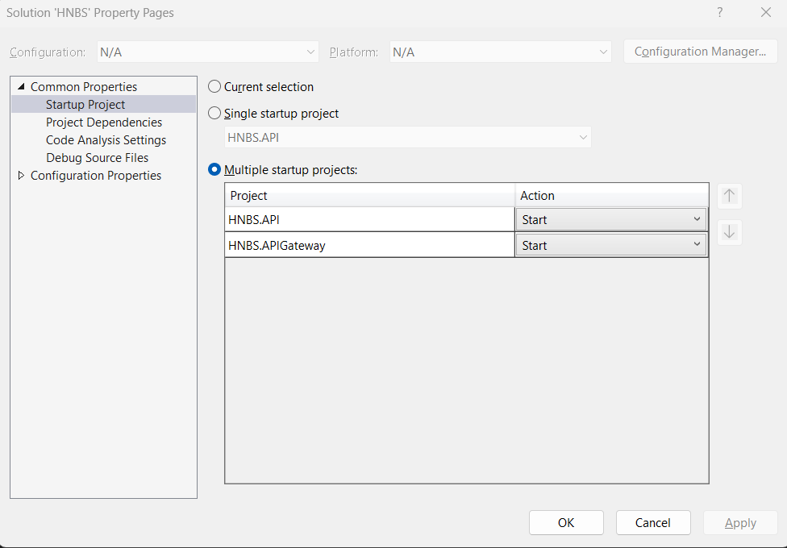
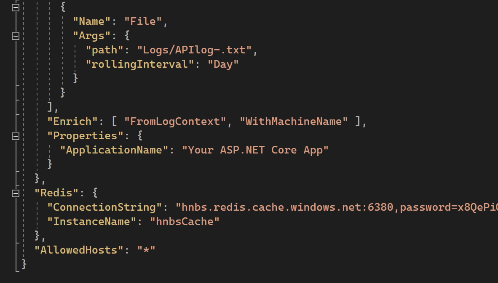
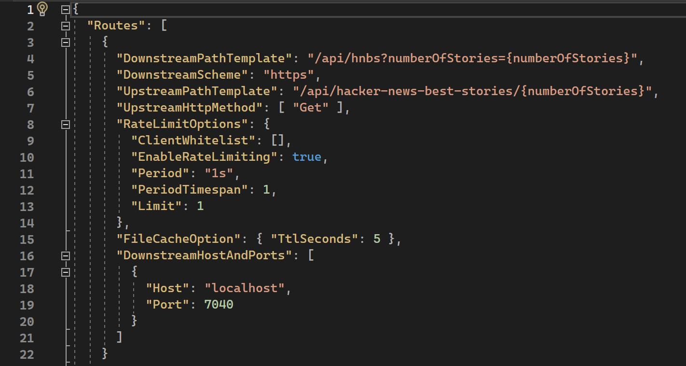

# HNBS facilitated with .NET Core API Gateway
## Overview
We enhanced the ```Hacker News Best Story service``` by adding an API Gateway, leveraging the benefits of Ocelot's features like rate limiting and gateway-level caching, to transform it into a microservice.
## Technologies Used

- .NET Core
- Ocelot (API Gateway)
- Azure Redis Cache
- StackExchange.Redis (Redis integration)
- Ocelot.Cache.Redis (Redis caching in Ocelot)

## Key Features

- Rate Limiting: Controls request frequency to prevent overload and abuse.
- API Gateway Caching with Azure Redis: Stores frequently accessed API responses in Azure Redis for faster retrieval and reduced server load.

## Technologies Used

- .NET Core
- Ocelot (API Gateway)
- Azure Redis Cache
- StackExchange.Redis (Redis integration)
- Ocelot.Cache.Redis (Redis caching in Ocelot)
- Serilog (for logging the incoming request that can be reviewed later)

## Prerequisites

- [.NET Core SDK](https://dotnet.microsoft.com/download)
- [Azure Redis Cache](https://azure.microsoft.com/en-us/services/cache/)
- [Ocelot.Cache.Redis](https://www.nuget.org/packages/Ocelot.Cache.Redis/#readme-body-tab)
- [Serilog](https://www.nuget.org/packages/serilog/)

## Getting Started

1. **Clone the Repository:**
   ```
   
   git clone hgit@github.com:jandginvestment/hnbs.git
   cd hnbs

   ```
   > you will find hnbs service and the corresponding API gateway project.
1. Restore NuGet packages:
   - In both projects run below commend to restore the nuget packages.
  ```
  dotnet restore
 ```

 1. Setting multiple startup project
    
	- open the hnbs solution in visual studio 2022 (64-bit) edition.
	- right click on the solution and click on properties in the menu.
	- select multiple startup project radio button and both the projects.
	- click on apply button.
 3. Open appsettings.json of the APIGatway project
     
	1. change the connection string as required
 1. Open the Ocelot.dev.json for below ocelot gateway configurations
    
	- Rate limiting uses Ocelot's built-in middleware.
	- Caching uses Azure Redis Cache for distributed caching.
	- Rate limiting rules.
 1. Run the application

 ### Benefits
 #### Rate Limiting
- The API Gateway enforces rate limiting using the AspNetCoreRateLimit library. Configure rate limiting parameters in appsettings.json under the "RateLimiting" section.

#### Azure Redis Caching
  - Azure Redis caching is implemented using the StackExchange.Redis library. Provide your Azure Redis connection details in the appsettings.json file under the "RedisCache" section.

### Endpoint
the endpoint is exposed as 
```
https://localhost:7777/api/hacker-news-best-stories/220
```
